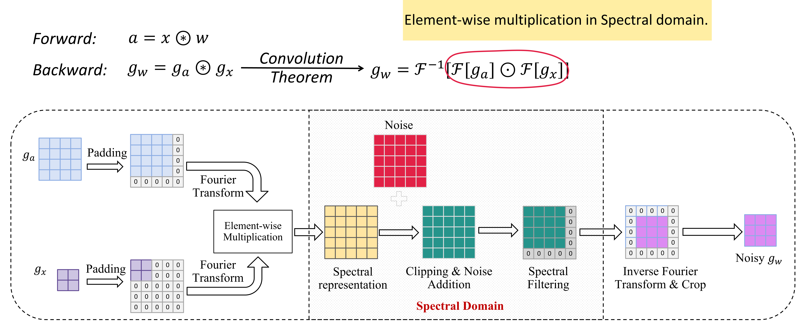
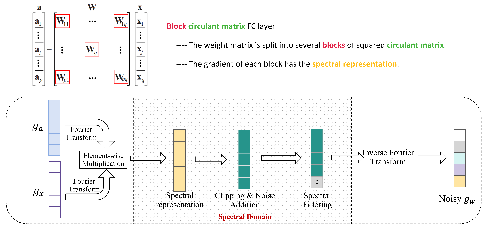

# Spectral-DP
Implementation of [Spectral-DP](https://arxiv.org/pdf/2307.13231), a differentially private deep learning method through spectral perturbation and filtering.
## Requirements
Python version >= 3.7.10

Torch 1.8.1 + cuda 11.6

[Opacus](https://opacus.ai/)

## Datasets and Models

## Implementation details
### Spectral-DP in the Conv2D layer
`models/conv2d.py` 
Implementation of Spectral-DP in convolutional layer.



### Spectral-DP in the Block Circulant FC layer 
`models/bc_linear.py`
Implementation of Block Spectral-DP in linear (fully connected) layer.



### Privacy Budget
Spectral-DP fits the privacy composition of DP-SGD.
The noise scale can be calculated according to any privacy library (Opacus: https://opacus.ai/).

`privacy_budget.py`
Calculate the noise scale according to the training configurations.

### Training
`train.py`
Training DP guaranteed models using Spectral-DP.

MNIST: 4-layer MLP (Model-1 in [Spectral-DP](https://arxiv.org/pdf/2307.13231))

```
python train.py --dataset mnist --model mlp_mnist --train_batch_size 250 --epochs 30
```

## Citations
```
@inproceedings{feng2023spectral,
  title={Spectral-DP: Differentially Private Deep Learning through Spectral Perturbation and Filtering},
  author={Feng, Ce and Xu, Nuo and Wen, Wujie and Venkitasubramaniam, Parv and Ding, Caiwen},
  booktitle={2023 IEEE Symposium on Security and Privacy (SP)},
  pages={1944--1960},
  year={2023},
  organization={IEEE Computer Society}
}
```